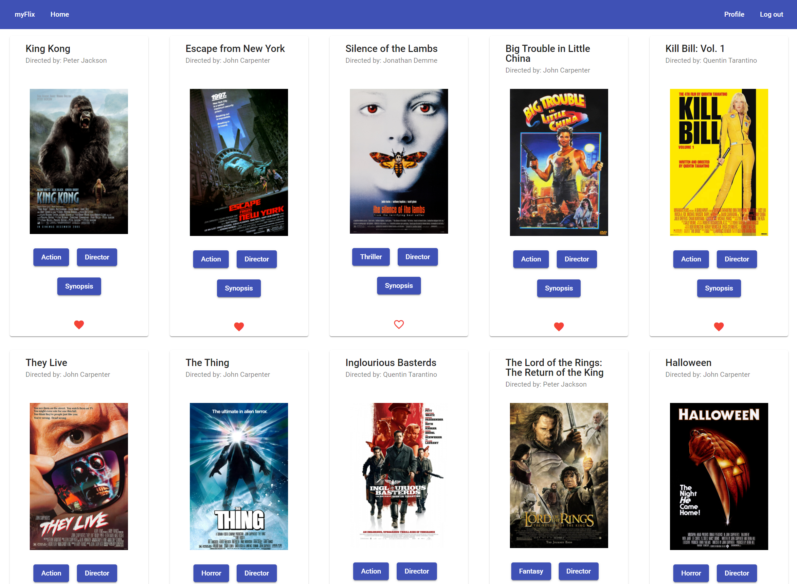
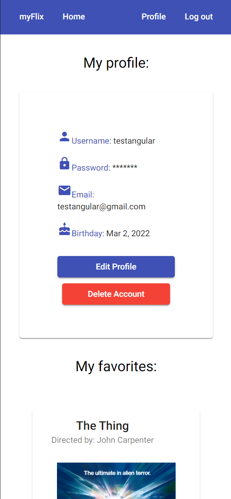

# MyFlixAngularClient
- Client-side for an application called myFlix, created using ANgular, based on its existing server-side code (REST API and database)
- Live site: https://numenot.github.io/myFlix-Angular-client/

# User stories
- As a user, I want to be able to receive information on movies, directors, and genres so that I
can learn more about movies I’ve watched or am interested in.
- As a user, I want to be able to create a profile so I can save data about my favorite movies

# Key features
- Welcome view where users are able to either log in or register an account.
- Once authenticated, the user can view all movies.
- Button that when clicked opens a director dialog, where details about the
director of that particular movie will be displayed.
- Button that when clicked opens a genre dialog, where details about that
particular genre of the movie will be displayed.
- Button that when clicked opens a synopsis dialog, where a summary of the movie will be displayed.
- User profile view where a user can edit their profile
- Button to add or remove movie from favorites list

# Technologies used
- Node.js
- Angular
- Angular Material
- Rest API
- JSDoc

# Startup
- Clone project
- Install necessary dependencies in package.json
- Navigate to project folder in Command Prompt
- Run ng serve
- Server should be running at http://localhost:4200/

# Build
Run `ng build` to build the project. The build artifacts will be stored in the `dist/` directory.

# Screenshots

## Desktop:

## Mobile:

